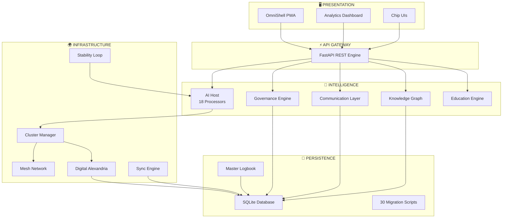
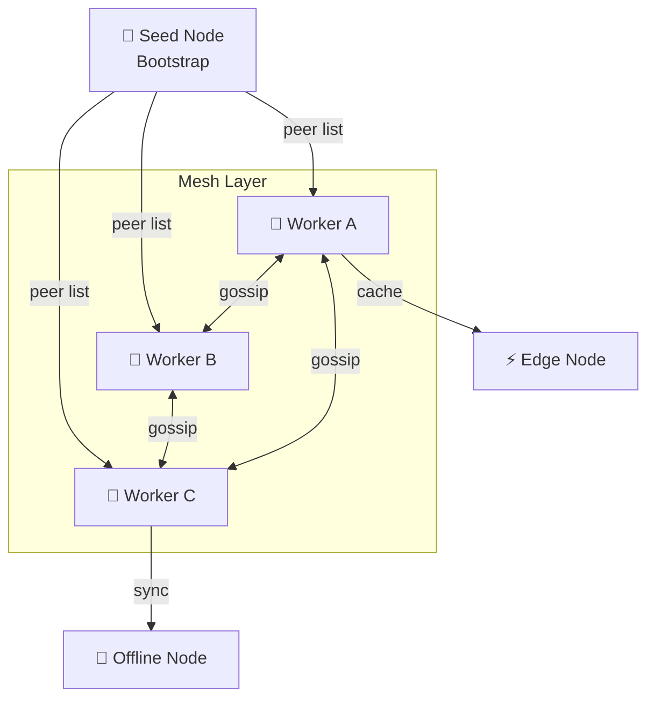
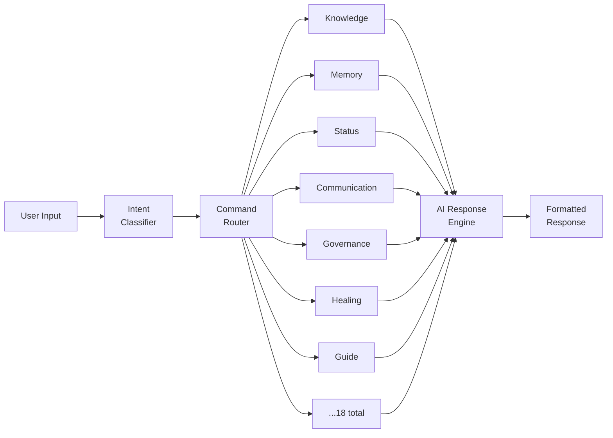
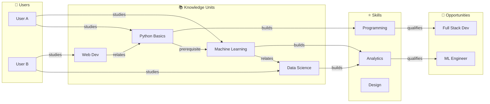
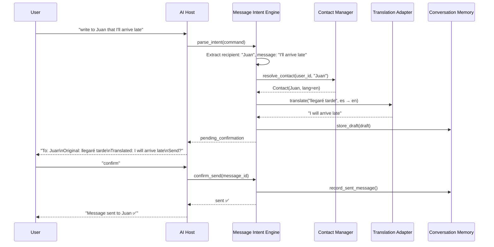
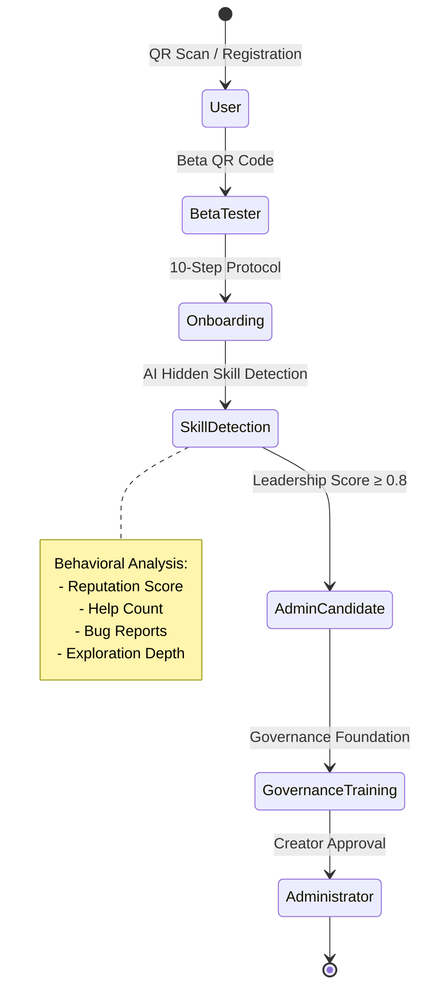

# OmniWeb System Diagrams

## 1. Global Architecture

## 2. Cluster Topology

## 3. AI Host Pipeline

## 4. Knowledge Graph Structure

## 5. Communication Layer Flow

## 6. Governance Evolution

