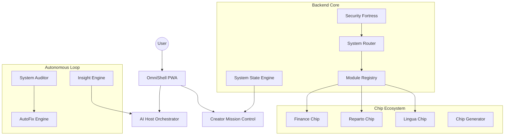

# Architecture Overview: OmniWeb OS

OmniWeb is a **Personal Web Operating System** designed as a unified orchestrator for AI-powered productivity, knowledge management, and specialized utility modules (Chips).

## Core Philosophy: The Unified Modular Architecure

Unlike traditional monoliths or fragmented microfrontends, OmniWeb operates on a **Hybrid MPA (Multi-Page Application)** model. This approach maximizes resilience and isolation:

- **Strict Isolation**: A failure in the `Finance Chip` cannot compromise the `AI Host` or the `Identity Layer`.
- **Framework Agnosticism**: Each module (Chip) is a self-contained environment. While the shell is Vanilla JS, chips can be built with any technology.
- **Dynamic Orchestration**: The system discovers and mounts modules at runtime without code changes in the core router.

## High-Level Diagram

## System Components

### 1. The Kernel (Backend Core)
The Python-based kernel (FastAPI) handles the heavy lifting: resource orchestration, security enforcement, and cross-chip communication via a unified Event Bus.

### 2. The AI Host
The system's nervous system. It processes natural language, classifies intent, and delegates tasks to specialized processors or chips.

### 3. The Chip Ecosystem
Modular "sub-apps" that implement specific business logic. Chips are identified by a `chip.json` manifest and offer a sandboxed runtime.

### 4. Autonomous Resilience
The **System Auditor** and **AutoFix Engine** continuously monitor the platform's health and apply patches or state corrections automatically, ensuring 99.9% uptime for the creator environment.
