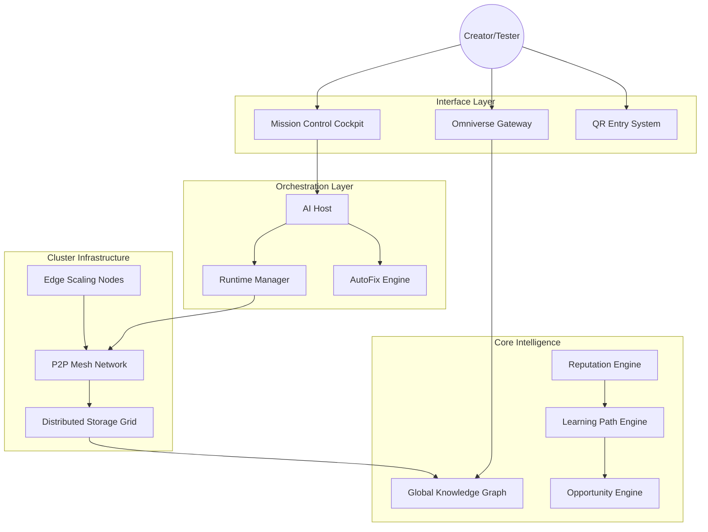

# Developer Showcase: Inside OmniWeb

## System Architecture Diagram

## Module Map

- `/backend`: Core FastAPI services and API routes.
- `/runtime`: The standalone execution engine and boot logic.
- `/chips`: Modular logic units for transcription, translation, and finance.
- `/infrastructure`: Database migrations, cluster configuration, and storage grid managers.
- `/frontend`: The interactive shell and Mission Control UI.
- `/docs`: Technical whitepaper, architecture specs, and development roadmap.

---
*OmniWeb: The Foundation for a Decentralized Society.*
